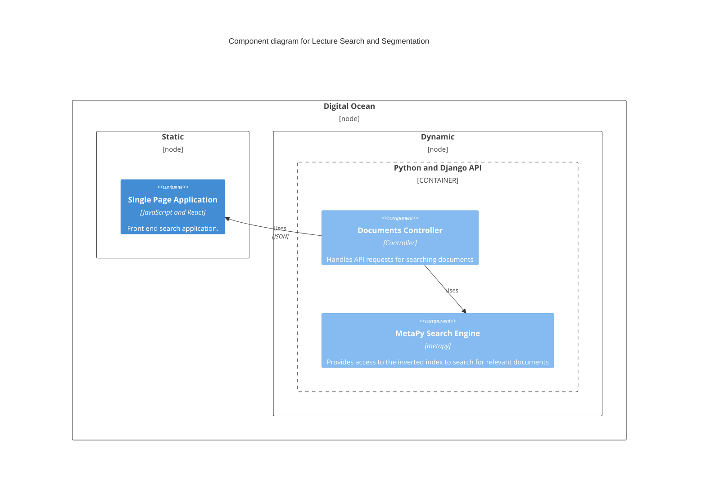

# Lecture Search and Slide Segmentation

## Introduction

### Motivation

### Problem Statement

### Proposed Solution

## Architecture

### Diagram



The Lecture Search Engine was created with the [metapy](https://github.com/meta-toolkit/metapy) NLP toolkit.

The Lecture Search Client was created with the [React](https://reactjs.org/) web application framework.

The Lecture Search API was created with the [Django](https://www.djangoproject.com/) web application framework.

The API and Client are automatically deployed to the Digital Ocean platform every time a commit
is pushed to the main branch.

The live Client can be accessed at the following URL:

https://stingray-app-3sdu7.ondigitalocean.app/

The live API can be accessed at the following URL:

https://sea-turtle-app-7y54u.ondigitalocean.app/documents/

The API only includes one endpoint: `/documents`. This endpoint accepts HTTP GET requests with a search query parameter. The search parameter is a space separated list of words. The endpoint responds with a json formatted list of search results.

Example:

```sh
(base) ➜  api git:(main) curl https://sea-turtle-app-7y54u.ondigitalocean.app/documents/\?search\=test
{"corpus": "CS410_lectures", "query": "test", "results": [{"03_video_id": "W03_L06", "04_title": "Evaluation Of Tr Systems Practical Issues", "01_doc_id": 17, "06_txt_path": "path/to/W03_L06.txt", "02_score": 14.651, "05_vid_path": "path/to/W03_L06.mp4", "00_rank": 1}, {"03_video_id": "W03_L01", "04_title": "Evaluation Of Tr Systems", "01_doc_id": 12, "06_txt_path": "path/to/W03_L01.txt", "02_score": 11.206, "05_vid_path": "path/to/W03_L01.mp4", "00_rank": 2}, {"03_video_id": "W11_L02", "04_title": "Text Categorization Evaluation Part 1", "01_doc_id": 81, "06_txt_path": "path/to/W11_L02.txt", "02_score": 7.386, "05_vid_path": "path/to/W11_L02.mp4", "00_rank": 3}, {"03_video_id": "W12_L04", "04_title": "Contextual Text Mining Mining Causal Topics With Time Series Supervision", "01_doc_id": 89, "06_txt_path": "path/to/W12_L04.txt", "02_score": 4.599, "05_vid_path": "path/to/W12_L04.mp4", "00_rank": 4}, {"03_video_id": "W10_L06", "04_title": "Text Clustering Evaluation", "01_doc_id": 77, "06_txt_path": "path/to/W10_L06.txt", "02_score": 4.599, "05_vid_path": "path/to/W10_L06.mp4", "00_rank": 5}]}
```

## Running the Application Locally

### Prerequisites
- MacOS or Linux recommended (not tested on Windows)
- [nodejs 16+](https://nodejs.org/en/download/package-manager/)
- [yarn](https://classic.yarnpkg.com/en/docs/install)
- python 3.5.6 
    - We've found the most reliable way of installing python 3.5.6 and all of the python dependencies is by using [conda](https://docs.conda.io/projects/conda/en/stable/user-guide/install/index.html).

#### API

The API is the server-side component that handles HTTP requests from the Client application.
This should be started in a terminal and left running before starting the Client application.

```sh
cd code/api
# create a conda environment with all python dependencies
conda env create -f environment.yml
# activate it
conda activate lecture_search
# run the database migrations
python manage.py migrate
# run the tests
python manage.py test
# try searching from the command line
python lecture_search_cli.py
# run the api
gunicorn api.wsgi
```

This will start an HTTP server that serves requests at the following URL: http://localhost:8000/documents

Example request: http://localhost:8000/documents?search=paradigmatic%20relationship&corpus=cs-410&max_results=5


#### Client

The Client is a browser based graphical user interface that issues HTTP requests to the API and displays user-friendly responses.
These commands must be run in a separate terminal instance from the API, and left running while testing the application.

```sh
cd code/client
# install the dependencies
yarn install
# run the application
yarn start
```

The Client is available at the following URL: https://localhost:3000


#### Corpus creation

```sh
cd code/prep
# create a conda environment
conda create --name corpus_create python=3.9.15
# activate it
conda activate corpus_create
# install the dependencies
pip install -r requirements.txt
# download course using coursera-dl
coursera-dl -ca {your CAUTH cookie value} cs-410
# create corpus
python prep.py
```

Each directory in `code/prep` will result in a new corpus. The corpus creator was modelled on file names downloaded by `coursera-dl` for the `cs-410` course and may not work on others.

## References

### The following resources were used when implementing the project:

1. https://spacy.io/usage
2. https://www.activestate.com/blog/how-to-do-text-summarization-with-python/
3. https://meta-toolkit.org/
4. https://github.com/meta-toolkit/metapy
5. https://www.djangoproject.com/
6. https://www.digitalocean.com/
7. https://reactjs.org/
8. https://pypi.org/project/bert-extractive-summarizer/
9. https://pypi.org/project/transformers/
10. https://en.wikipedia.org/wiki/Natural_language_processing