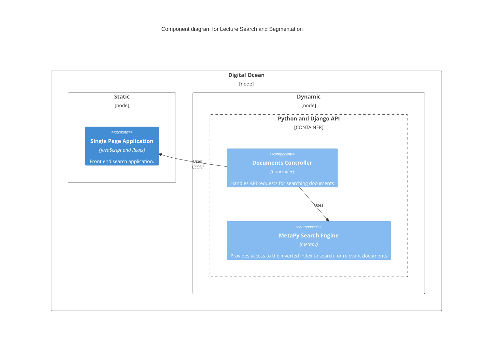

# Lecture Search and Slide Segmentation

## Introduction

### Motivation

### Problem Statement

### Proposed Solution

## Architecture

### Diagram



The Lecture Search Engine was created with the [metapy](https://github.com/meta-toolkit/metapy) NLP toolkit.

The Lecture Search Client was created with the [React](https://reactjs.org/) web application framework.

The Lecture Search API was created with the [Django](https://www.djangoproject.com/) web application framework.

The API and Client are automatically deployed to the Digital Ocean platform every time a commit
is pushed to the main branch.

The live Client can be accessed at the following URL:

https://stingray-app-3sdu7.ondigitalocean.app/

The live API can be accessed at the following URL:

https://sea-turtle-app-7y54u.ondigitalocean.app/documents/

## Running the Application Locally

### Prerequisites
- nodejs 16+
- python 3.9+
- MacOS or Linux recommended

#### Client

```sh
cd code/client
# install the dependencies
yarn install
# run the application
yarn run
```

The Client is available at the following URL: https://localhost:3000


#### API

```sh
cd code/api
# create a conda environment
conda create --name lecture_search python=3.5.6
# activate it
conda activate lecture_search
# install the dependencies
pip install -r requirements.txt
# run the database migrations
python manage.py migrate
# run the tests
python manage.py test
# try searching from the command line
python lecture_search_cli.py
# run the api
gunicorn api.wsgi
```

The API is available the following URL: http://localhost:8000/documents

Try out a document search through the API: http://localhost:8000/documents?search=term%20frequency